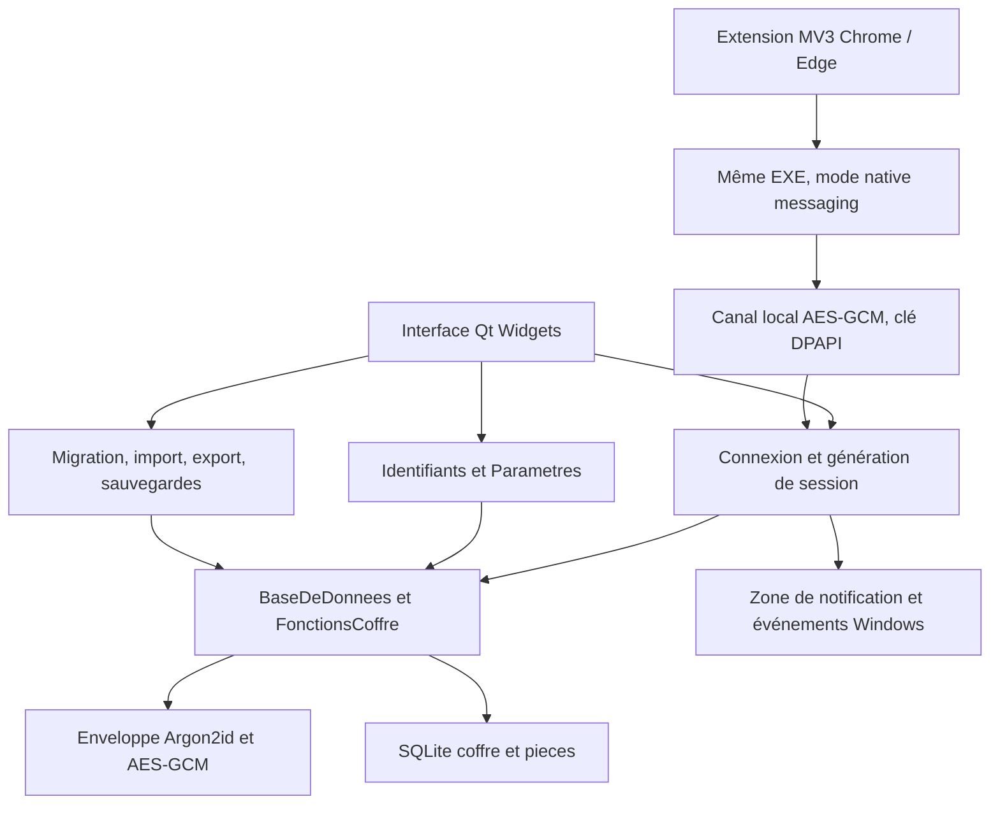

# Architecture locale de VaultSafe

4 octobre 2026 — 3.2.0-alpha.1. Application existante portée vers Qt ; phase 10 exclue.

**État actuel, 6 octobre 2026 :** version 3.3.2-alpha.1, installateur local désormais
explicitement demandé et tests conservés. Les recettes ci-dessous sont historiques ;
consulter [la qualification actuelle](QUALIFICATION.md) pour les résultats et limites
de cette livraison. Aucune publication GitHub, signature ou intégration Windows Hello.

## Composants

`database.py` conserve le point d’entrée compatible. Le dépôt exige une clé ouverte, indépendamment des contrôles dans les services. Les composants métier n’importent pas l’interface. Signaux Qt, tâches bornées et générations séparent les travailleurs de l’interface ; seul le fil Qt principal touche les widgets. Un travailleur sérialise les opérations du coffre ; un second exécute les analyses par petits lots. Une voie réservée ferme les clés et sockets, afin qu’une copie chiffrée vers un disque lent ne retarde pas le verrouillage.

## Formats et compatibilité

SQLite `application_id` identifie le conteneur ; `user_version=3` correspond aux tables `coffre` et `pieces`. Un coffre neuf non initialisé a la version 1 et seulement `coffre`. Les tables, vues et triggers sont contrôlés, les tailles bornées, `trusted_schema=OFF` et `quick_check` appliqués. Les connexions SQLite sont fermées explicitement.

La ligne `coffre` conserve l’en-tête public canonique, nonce et document chiffré. L’en-tête cryptographique **v2** expose UUID du coffre, algorithmes, sel et coûts Argon2id bornés ; sa clé de données aléatoire de 32 octets est enveloppée avec une clé maître Argon2id (64 MiB, trois passages, quatre lanes). Chaque enveloppe utilise AES-256-GCM, nonce aléatoire de 12 octets et AAD propre à son rôle. Le document utilise la clé de données et l’en-tête complet comme AAD. Les nonces sont renouvelés à chaque écriture.

Le premier déverrouillage réussi d’un en-tête v1 effectue une conversion transactionnelle vers v2 et le schéma 2 ; une erreur de mot de passe ne migre rien. L’ancienne base PBKDF2 avec fiches en clair est un format différent : import explicite, authentifié, en lecture seule, transaction unique dans le coffre cible. La source et ses dates sont conservées. Aucun fichier personnel n’est ouvert par les tests.

Créer une clé de secours nécessite une preuve du mot de passe maître. Cette clé aléatoire de 256 bits, encodée Base32 canonique `VS2-…`, enveloppe la même clé de données avec un AAD distinct, lié à l’UUID. Elle est montrée une fois. Changer le mot de passe renouvelle l’enveloppe maître en conservant les données et l’enveloppe de récupération. Récupérer le coffre remplace le mot de passe et renouvelle la clé de secours atomiquement. Le mot de passe et la clé de secours ne sont jamais persistés en clair dans le coffre. Les anciennes sauvegardes restent liées à leurs anciennes enveloppes.

## Modèle chiffré

Schéma 2 : `schema`, `identifiants`, `parametres`, `dossiers`, `historique`, `corbeille`. Validation stricte des clés, types, UUID, dates et références.

| Objet | Représentation |
| --- | --- |
| Fiche | UUID, titre, utilisateur, mot de passe, site, notes, dates, modèle, dossier, tags texte uniques, favori, champs personnalisés, TOTP, échéance, manifeste de pièces |
| Modèle | Connexion, note, carte, identité, licence, Wi-Fi, serveur ; mot de passe requis uniquement pour connexion |
| Champ | Nom, valeur et booléen secret ; le booléen commande le masquage, toutes les valeurs sont chiffrées |
| Dossier | UUID, nom et parent facultatif ; références vérifiées, cycles refusés |
| Révision | Ancienne fiche complète et date ; au plus 20 par fiche, pièces incluses par référence |
| Corbeille | Fiche complète et date de suppression ; restauration, purge explicite `SUPPRIMER` |
| TOTP | Secret, algorithm, digits, period, label ; RFC 6238 SHA1/SHA256/SHA512, 6/8 chiffres |
| Rappel | Échéance dans la fiche, notification générique à sept jours ou après échéance ; aucune donnée secrète dans Windows |

Limites de validation : 32 MiB de document, 256 MiB de conteneur, 50 000 fiches actives/corbeille, 50 000 révisions, 1 000 dossiers, 40 champs et 30 tags par fiche. Les bornes ne promettent pas des performances à leur maximum ; le document entier est lu et réécrit à chaque transaction.

Pièces : table séparée avec UUID, numéro, nonce et contenu AES-GCM en blocs de 64 Kio. L’AAD lie chaque bloc au coffre, à la pièce et à son numéro. Nom, taille, SHA-256 et nombre de blocs restent dans le manifeste chiffré. Maximum 16 Mio par pièce, 20 par fiche et plafond de stockage des pièces de 96 Mio (chiffrement inclus). L’intégrité contrôle présence, ordre, longueur, tags et empreinte. Les anciennes pièces restent tant qu’une fiche, révision ou corbeille les référence ; les blocs orphelins sont supprimés dans la même transaction. La purge logique ne garantit pas l’effacement physique des anciennes pages SQLite.

## Sessions, transactions et sauvegardes

`Connexion.est_connecte` découle de la présence réelle de la clé. Le dépôt n’entretient pas de document clair entre opérations. Verrouiller écrase au mieux la clé mutable, arrête la liaison navigateur, détruit les popups et oublie les objets de vue. Python et les bibliothèques natives peuvent conserver des copies temporaires : purge mémoire parfaite non garantie.

Écritures `BEGIN IMMEDIATE`, synchronisation `FULL`. Une empreinte de la ligne courante détecte une session périmée ; elle ne remplace pas l’authentification. Une autre instance ayant écrit oblige à se reconnecter. Imports et mises à jour de préférences sont groupés en une transaction. Les journaux contiennent des représentations chiffrées.

Sauvegarde : API SQLite backup vers fichier temporaire, authentification et intégrité de toutes les pièces, puis remplacement atomique. Restauration : copie de source, vérification complète, remplacement, fermeture de la session. Ouvrir une `.vaultsafe` via l’interface crée une copie `.db` exclusive vérifiée. Les sauvegardes automatiques prennent un snapshot local sous verrou, puis copient seulement du chiffré vers le dossier choisi ; un disque lent ne maintient pas une clé ouverte. Rétention limitée à un motif exact contenant l’UUID du coffre. Aucun service de sauvegarde permanent après fermeture.

Chemin par défaut `%LOCALAPPDATA%\VaultSafe\vaultsafe.db` ; pointeur public `coffre-actif.json` pour le dernier coffre. `VAULTSAFE_DATA_DIR` permet des contrôles isolés. Au démarrage, un coffre invalide est conservé et l’utilisateur peut sélectionner un autre fichier. Le programme et les données sont séparés.

## Windows et réseau

La zone de notification propose afficher/verrouiller/quitter. WTS et les événements de veille verrouillent le coffre. Les copies utilisent les exclusions `CanIncludeInClipboardHistory` et `CanUploadToCloudClipboard` avec DWORD zéro avant le texte Unicode. L’effacement différé ne retire que la copie encore égale à celle de VaultSafe. Des outils tiers peuvent ignorer ces exclusions.

Le démarrage Windows est volontaire (HKCU Run, `--reduire`). Qt gère les coordonnées logiques et le zoom Windows ; le zoom interne va de 100 à 200 %. `ui/placement.py` centralise les géométries utilisables, y compris négatives, les marges natives et le retour d’un écran retiré. Les favicons réseau et la saisie globale sont supprimés. Le contrôle de fuites reste volontaire, sur quatre requêtes simultanées au maximum.

## Navigateur

Extension MV3 : `activeTab`, `scripting`, `nativeMessaging`, CSP locale et absence de stockage des secrets. Service worker maintenu par `connectNative` durant la confirmation Windows, pour survivre à la fermeture du popup. Il relit l’onglet après confirmation ; l’injection dans le cadre 0 vérifie l’origine, le formulaire visible unique et son action de même origine. Aucun clic ni soumission automatique.

Le même EXE reconnaît l’origine `chrome-extension://…` en argument et sert des messages JSON encadrés sur ses pipes hérités, sans charger Qt. Le manifeste et les clés HKCU sont installés exclusivement par le bouton Associer. Les identifiants d’extension autorisés sont exacts. Le serveur attend les événements de sockets, sans réveil périodique ; une socket de réveil permet l’arrêt immédiat.

IPC sur 127.0.0.1 et port aléatoire : AES-GCM avec AAD distincts requête/réponse, réponse liée au nonce de requête. Clé de session DPAPI utilisateur, requêtes expirantes, IDs anti-rejeu, taille 512 Kio, délais, files et concurrence bornés. Le fil UI vérifie l’origine exacte HTTPS (HTTP uniquement localhost), la session et l’autorisation humaine ; il relit la fiche après confirmation. La liaison est coupée au verrouillage. DPAPI ne protège pas contre un programme hostile sous le même compte Windows.

## Références

[Argon2id RFC 9106](https://www.rfc-editor.org/rfc/rfc9106.html), [cryptography AES-GCM](https://cryptography.io/en/50.0.2/hazmat/primitives/aead/), [TOTP RFC 6238](https://www.rfc-editor.org/rfc/rfc6238.html), [Chrome native messaging](https://developer.chrome.com/docs/extensions/develop/concepts/native-messaging), [Edge native messaging](https://learn.microsoft.com/en-us/microsoft-edge/extensions-chromium/developer-guide/native-messaging).

## Cahier des charges et phases d’optimisation

4 octobre 2026. **Statut : O1 à O6 implémentées ; livraison Qt reconstruite, recette locale O7 documentée ci-dessous.** La qualification O7 complète reste conditionnée aux contrôles matériels et d’endurance indiqués en fin de document. Les objectifs restent des critères de recette ; les cas non observés ne sont pas déclarés validés. La phase 10 reste exclue.

### 1. Résultat attendu et choix technique

VaultSafe doit rester une application locale Windows, facile à manipuler, réactive au clavier et à la souris, et discrète lorsqu’elle reste en zone de notification. « Consommation » signifie ici processeur, mémoire, disque et réseau. Le fonctionnement quotidien doit rester disponible hors ligne.

Python et les services du coffre sont conservés. **PySide6 / Qt Widgets est adopté**, avec un modèle de métadonnées et une liste qui ne peint que les cartes visibles, des pages conservées pendant la session et une zone de notification intégrée. Ce choix ne garantit pas à lui seul la vitesse ; la recette mesure le résultat réel.

L’application existante et son identité visuelle restent la référence : couleurs, typographie, cartes, formulaires et navigation Mes identifiants / Sécurité / Paramètres. Une évolution technique doit reproduire ces repères et faciliter l’usage. Le chiffrement, le format des coffres et les services métier sont conservés lors d’un éventuel portage de l’interface.

### 2. Observations dans le code actuel

Les observations suivantes concernent l’ancienne version 3.1.0. Les lectures et l’ouverture de la liste ont ensuite été mesurées sur un coffre fictif :

| Point | Effet probable | Travail prévu |
| --- | --- | --- |
| `stockage_chiffre.py` : `_lire()` déchiffre le document entier ; `lire_parametre()` appelle cette lecture | Plusieurs accès aux préférences répètent le même travail | Lire les préférences en une opération, utiliser un état de session minimal et invalider après changement |
| `ui/liste.py` et `ui/securite.py` : analyse des mots de passe lors de la construction | Attente avant affichage, surtout sur un grand coffre | Afficher d’abord les fiches, analyser à la demande et réutiliser les résultats dérivés valides |
| `session_locale.py` : pompe toutes les 100 ms ; surveillance Windows et contrôle périodique à 30 s | Réveils réguliers même lorsque la fenêtre est cachée | Recevoir les événements Windows et programmer seulement les échéances utiles |
| `rappels()` relit son paramètre avant de vérifier si le contrôle du jour a déjà eu lieu | Déchiffrement périodique inutile | Tester d’abord l’état local et reprogrammer le prochain contrôle utile |
| Raccourci global surveillé par une seconde boucle à 100 ms | Réveils supplémentaires et intégration en double avec le navigateur | Simplifier le parcours de remplissage et retirer cette boucle si son mode est retiré |
| Liste déjà paginée à 15 fiches, cartes détruites puis recréées lors des filtres | Création répétée de widgets ; la pagination seule n’élimine pas ce coût | Réutiliser les cartes visibles et conserver sélection, recherche et position |

Ne pas confondre ces causes possibles avec une preuve que CustomTkinter ou Python est le principal responsable. O1 établit la référence avant toute décision.

### 3. Objectifs mesurables

Machine de référence : Windows 11, processeur quatre cœurs, 8 Go de RAM, SSD, écran 60 Hz. Relever le matériel réellement utilisé. Coffres fictifs de 100, 1 000 et 5 000 fiches ; cas avec historique, corbeille et pièces. Les objectifs ci-dessous sont des cibles de recette, pas des résultats acquis. Une limite manquée est expliquée avec sa mesure, sans annoncer que la phase est terminée.

| Mesure | Cible initiale |
| --- | --- |
| Retour visuel après clic ou touche | p95 ≤ 100 ms |
| Navigation / première page de 15 fiches, coffre déjà ouvert, 1 000 fiches | p95 ≤ 250 ms |
| Recherche, de la dernière frappe au résultat, temporisation incluse, 1 000 fiches | p95 ≤ 250 ms |
| Recherche et première page avec 5 000 fiches | p95 ≤ 500 ms |
| Réaffichage de la fenêtre depuis la zone de notification | p95 ≤ 200 ms ; déverrouillage mesuré séparément |
| Démarrage jusqu’à l’écran de connexion utilisable | médiane ≤ 2 s après redémarrage ; ≤ 1 s lors des relances suivantes |
| Défilement sur écran 60 Hz | intervalle p95 ≤ 33 ms entre mises à jour pendant le geste ; aucun gel récurrent de plus de 100 ms |
| Repos visible, après chargement | processeur moyen ≤ 0,5 % de la machine sur 10 min |
| Zone de notification, verrouillée et au repos | processeur moyen ≤ 0,2 % de la machine sur 10 min |
| Mémoire privée engagée, cible à vérifier en O1 | ≤ 100 Mio en zone de notification verrouillée ; ≤ 180 Mio visible avec 1 000 fiches |
| Stabilité après 50 cycles ouvrir / rechercher / modifier / verrouiller / réduire | pas de croissance monotone ; écart stabilisé ≤ 15 Mio, handles et fils stables |
| Coffre verrouillé et au repos, après les travaux déjà engagés | aucun déchiffrement, aucune analyse, aucune écriture du coffre et aucun trafic Internet |
| Enregistrement | retour visuel ≤ 100 ms ; confirmation de succès uniquement après écriture durable |

Le CPU est calculé sur les temps processeur de tous les processus propres à VaultSafe, divisés par la durée et le nombre de processeurs logiques. Mesurer aussi la mémoire privée engagée et la mémoire résidente ; une baisse de la seule mémoire résidente ne suffit pas. Les processus temporaires de liaison navigateur sont inclus dans les parcours concernés. Aucune promesse de « zéro RAM » ni réduction artificielle de mémoire par vidage forcé du working set.

### 4. Périmètre fonctionnel simplifié

| Décision | Fonctions concernées |
| --- | --- |
| Essentiel conservé | Connexion, verrouillage, recherche, ajout/modification/copie, générateur, notes, favoris, dossiers, TOTP, historique/corbeille, import/export, sauvegarde/restauration, changement du maître et secours |
| Conservé et chargé seulement à l’usage | Pièces jointes, modèles spécialisés, champs personnalisés, tags, plusieurs coffres, outils de récupération/migration, import avec aperçu, extension Chrome/Edge et contrôle volontaire des fuites |
| Simplifié | Une entrée par outil dans Paramètres ; options avancées repliées ; un moteur de générateur ; un moteur d’import ; une analyse partagée entre liste et Sécurité |
| Retrait prévu de l’interface courante | Remplissage global dans une fenêtre arbitraire avec Ctrl+Alt+V, doublon moins précis de la liaison navigateur ; téléchargement de favicons remplacé par des icônes locales ; répétition des mêmes actions dans plusieurs panneaux |
| Retrait prévu des traitements | Analyse complète à chaque navigation, vérifications sans échéance utile, polling permanent des fonctions désactivées, animations et effets décoratifs continus |
| Retrait après vérification des appels | Écrans et wrappers devenus inutilisés, branches de code abandonnées, dépendances exclusivement utilisées par les fonctions retirées |

Une fonction secondaire n’est pas inutile simplement parce qu’elle existe : son coût doit être nul lorsqu’elle n’est pas utilisée. Garder les valeurs et types des fiches existantes, y compris les champs d’anciennes fonctions. Retirer un bouton ou un module ne doit jamais supprimer une fiche, une pièce, un historique, une sauvegarde ni empêcher l’ouverture d’un ancien coffre. Les anciens réglages inconnus peuvent être ignorés sans détruire les données.

### 5. Architecture de performance

Séparer quatre responsabilités : interface, services métier, accès au coffre, intégrations Windows. L’interface demande une action et reçoit un résultat ; elle n’attend pas une analyse complète, un réseau lent ou une grosse opération de fichier. Les services du coffre restent utilisables sans CustomTkinter ni Qt. Extraire les dialogues Tk actuellement présents dans `SessionLocale` vers un adaptateur d’interface.

Un coordinateur de session possède l’état ouvert/verrouillé, une génération de session et une révision de données. Les écritures sont sérialisées. Les résultats de lecture, recherche, analyse et navigateur portent ces références ; un résultat devenu ancien après modification, changement de coffre ou verrouillage est rejeté. Une fiche utilisée pour une copie ou un remplissage est relue et autorisée au moment de l’action.

Faire une lecture groupée par opération métier, puis produire des projections de liste sans mot de passe, TOTP ou champs secrets. Conserver seulement les métadonnées nécessaires en mémoire pendant la session ouverte. Les préférences sont lues ensemble et mises à jour explicitement. Les indices de recherche et résultats dérivés sont bornés, réservés à la session et invalidés précisément ; aucun cache persistant de secrets ou d’empreintes de mots de passe.

L’analyse de force et de réutilisation s’exécute une fois par révision utile, sur demande ou après une modification pertinente. Ne pas utiliser le mot de passe comme clé de cache. Les résultats affichables sont indexés par identifiant et révision. Le tableau de bord accepte un état « Analyse non effectuée » ou « Analyse en cours », sans chiffre inventé.

Un petit nombre de tâches simultanées et des files bornées évitent la multiplication des fils. Pour les traitements Python lourds, un fil ne garantit pas à lui seul la fluidité à cause du partage d’exécution : mesurer le retard de l’interface et découper les traitements si nécessaire. Éviter d’envoyer les secrets à des processus enfants par sérialisation. Seul le fil principal modifie les widgets ; les travailleurs signalent un résultat par un mécanisme sûr pour l’interface utilisée.

Conserver d’abord le format chiffré actuel. Si, après lectures groupées et traitement asynchrone, son coût bloque encore les objectifs à 5 000 fiches, prévoir une étude séparée de stockage chiffré par fiche : AAD liant coffre/fiche/version, nonces uniques, transactions, intégrité, migration sur copie et retour arrière. Cette refonte ne doit pas devenir une modification improvisée pendant le portage graphique.

### 6. Fonctionnement en zone de notification

| État | Travail autorisé |
| --- | --- |
| Visible et ouvert | Affichage, actions explicites, analyse demandée, échéances effectivement dues |
| Masqué et ouvert selon le réglage de l’utilisateur | Verrouillage à échéance, liaison navigateur activée et demandée, sauvegarde due après modification ; pas d’analyse, de rafraîchissement de liste ou de favicons |
| Masqué et verrouillé, mode conseillé | Menu Afficher / Quitter et événements Windows ; aucune lecture des données ni liaison de secrets |
| Traitement de fichier déjà engagé | Terminer proprement un snapshot chiffré ou annuler avant publication du résultat ; aucune confirmation de succès prématurée |
| Fermeture | Arrêter les travaux, fermer connexions et canaux, retirer l’icône, quitter sans processus orphelin |

Respecter le réglage de verrouillage lors de la réduction. Masquer ne signifie pas automatiquement verrouiller ; ces deux états restent distincts et visibles dans le menu. Suspendre les mises à jour visuelles, les compteurs TOTP et les tâches non essentielles dès que la fenêtre est masquée.

Remplacer les boucles à 100 ms par des événements natifs et des échéances uniques. Sous Tk, la notification d’un travailleur passe par un message Windows ou un mécanisme compatible avec le fil principal, jamais par un appel direct à Tk depuis le travailleur. Sous Qt, utiliser signaux/slots et timers à échéance. Un repli par polling doit être justifié et respecter les budgets mesurés, notamment la rapidité du verrouillage Windows.

Reprendre la surveillance WTS après création ou remplacement du HWND, plutôt que vérifier ce handle dix fois par seconde. Le verrouillage de session et la veille doivent continuer à invalider immédiatement les autorisations. Les rappels se calculent à l’ouverture, après changement d’échéance et au changement de jour. Les sauvegardes se programment après une modification et à leur vraie échéance ; elles ne parcourent pas le coffre toutes les trente secondes.

Le serveur de liaison reste en attente bloquante, avec délais et limites, et ne démarre que si l’extension est associée. Il s’arrête au verrouillage. Aucun réseau Internet au repos ; les vérifications de fuites restent manuelles. Les connexions loopback de l’extension sont distinguées du trafic Internet dans les mesures.

### 7. Expérience utilisateur et design

Afficher rapidement la structure de la page et les premières fiches ; réserver les traitements secondaires à une mise à jour ultérieure. Préserver la position de défilement, le filtre, le focus et la sélection après modification d’une fiche. Une erreur conserve la saisie et propose une action claire. Un traitement long montre un statut et permet l’annulation lorsque cette action peut rester atomique.

Les cartes affichent les métadonnées et les actions courantes ; les secrets se chargent au moment de leur consultation. Pour CustomTkinter, garder la pagination de 15 fiches et réutiliser les composants. Pour Qt, privilégier `QListView` / `QAbstractListModel` et un delegate reprenant les cartes ; ne pas créer un widget complet pour chacune des milliers de fiches. Une hauteur uniforme n’est activée que si le contenu le permet.

Préserver navigation clavier, raccourcis utiles, ordre de tabulation, contraste, focus visible et redimensionnement. Vérifier 100 %, 125 % et 150 % de mise à l’échelle et l’usage au clavier. Préférer des composants prévisibles à des fenêtres personnalisées qui imposent des redessins constants. Les ajustements de bordures, arrondis et fenêtres sont locaux et ne modifient pas l’identité visuelle.

### 8. Sécurité, données et discipline de travail

Conserver Argon2id et ses coûts, AES-GCM, l’authentification, les AAD, l’atomicité et les garanties de restauration. Le temps de dérivation du maître est mesuré à part ; il ne doit pas être réduit pour gagner une comparaison de performances. Une accélération par cache ne doit pas empêcher la détection d’une écriture par une autre instance.

Au verrouillage : invalider la génération, arrêter la liaison, annuler les travaux non indispensables et vider les vues, projections, analyses et références aux données. Les résultats tardifs sont détruits et ne réouvrent jamais un dialogue. Un travail natif déjà en cours peut finir avant libération ; documenter cette limite sans promettre une purge mémoire parfaite en Python.

Toutes les mesures utilisent des coffres fictifs dans un répertoire temporaire isolé. Aucun accès à une base personnelle. Profils : uniquement durées, tailles, compteurs et identifiants de scénarios fictifs ; jamais de secret, titre personnel ou clé dans les logs. Les fixtures, tests, rapports et exécutables d’essai sont supprimés immédiatement après le contrôle, y compris sur erreur. Les quelques valeurs de décision peuvent être consignées dans ce document sans conserver de rapport de test.

Continuer dans le projet existant. Un seul exécutable d’application reste dans la livraison, accompagné de ses dépendances nécessaires. Une expérimentation Qt ne constitue pas une deuxième application distribuée ; son prototype et ses fichiers temporaires sont supprimés après comparaison. Mettre à jour les documents utiles existants, sans multiplier les plans Markdown.

### 9. Phases et critères de passage

| Phase | Actions et livrable | Condition de passage |
| --- | --- | --- |
| **O1 — Mesurer** | Coffres fictifs, profilage du démarrage/navigation/recherche/écriture, CPU/RAM/handles au repos visible et masqué ; relever temps de déchiffrement, analyses, nombre de lectures et réveils | Référence chiffrée reproductible ; trois premières causes identifiées ; méthodes de mesure documentées |
| **O2 — Simplifier** | Unifier les points d’entrée, retirer le remplissage global et les favicons réseau, charger les outils avancés à l’usage, enlever les modules effectivement inutilisés | Parcours essentiels conservés ; aucune perte de données ou rupture de compatibilité ; consommation des outils désactivés nulle |
| **O3 — Optimiser le moteur** | Lectures groupées, préférences de session, projections sans secrets, analyse par révision, invalidation, travaux bornés hors interface, import/export/sauvegarde avec progression | Aucun déchiffrement répété pour chaque préférence d’une même action ; interface réactive pendant traitement ; résultats périmés rejetés ; écritures toujours durables |
| **O4 — Rendre le repos sobre** | États explicites, échéances réelles, suspension du travail masqué, notifications Windows au changement, arrêt propre, chargements tardifs des bibliothèques lourdes | Budgets CPU/mémoire de repos atteints ou écart précisément établi ; absence de trafic et d’accès au coffre au repos verrouillé ; pas de processus orphelin |
| **O5 — Choisir et optimiser l’interface** | Corriger les reconstructions CustomTkinter ; réaliser une comparaison Qt limitée à connexion/liste/recherche/tray avec même moteur, données et design | Choix fondé sur latence, mémoire, CPU masqué, clavier et packaging ; aucune décision basée uniquement sur l’apparence du prototype |
| **O6 — Finaliser les parcours** | Si Qt retenu, porter les écrans dans l’application existante et retirer Tk/pystray devenus inutiles ; sinon finaliser les vues réutilisées. Préserver fiches, imports, restauration, TOTP, navigateur et échelle | Un seul moteur graphique livré ; même design ; parcours réels avec données fictives validés ; mode native messaging sans chargement graphique |
| **O7 — Recette et livraison locale** | Comparaison finale sur 100/1 000/5 000 fiches, 50 cycles de manipulation, verrouillage/veille, annulation/conflits, restauration et endurance de deux heures ; reconstruction unique puis nettoyage | Objectifs mesurés, aucune régression de sécurité ou de données, seul exécutable final fonctionnel, fichiers temporaires retirés ; limitations restantes explicitement indiquées |

Ordre de dépendance : O1 → O2 → O3 → O4 → O5 → O6 → O7. Chaque phase est petite et vérifiable ; ne pas engager un portage complet avant de savoir si les optimisations du moteur et du repos suffisent.

**Décision O5 appliquée :** PySide6 / Qt Widgets est adopté après comparaison de l’ouverture de la liste et du fonctionnement des parcours conservés. CustomTkinter, pystray, Pillow et darkdetect sont retirés de l’environnement du projet ; les anciens écrans Tk sont retirés des sources. Le gain de RAM n’est pas supposé : les mesures figurent ci-dessous. Le mode liaison navigateur reste un chemin minimal du même EXE, sans import de Qt. Les bibliothèques Qt restent séparées, avec leurs notices et licences dans la livraison.

### 10. Recette concrète et définition de terminé

Mesurer les interactions au moins 30 fois, après quelques passages de préparation, et conserver médiane/p95 ; mesurer séparément démarrages après redémarrage et relances. Au repos, ignorer les deux premières minutes de stabilisation puis observer dix minutes. L’endurance vérifie les tendances de mémoire, handles, fils et accès disque sur deux heures. Mesurer la livraison empaquetée, pas seulement le code lancé depuis Python.

Scénarios prioritaires : ouvrir et chercher pendant analyse ; modifier sans perdre focus ; copier une fiche mise à jour ; TOTP uniquement dans une vue visible ; masquer puis réafficher ; verrouiller pendant une tâche ; changer de coffre avec travail en attente ; restaurer puis se reconnecter ; recevoir une demande navigateur expirée ; refuser une demande après verrouillage ; fermer avec sauvegarde en cours ; rouvrir un ancien coffre avec modèles avancés après simplification.

La livraison est considérée optimisée lorsque les budgets convenus sont vérifiés, les fonctions essentielles restent correctes, la zone de notification ne travaille que sur événement ou échéance, et le projet reste propre. **La phase 10, Windows Hello, les abonnements et les services web restent hors de ce chantier.**

### Références techniques de ce plan

Les vues modèle/vue et les delegates Qt permettent des mises à jour ciblées et un rendu personnalisé des cartes : [documentation officielle Qt](https://doc.qt.io/qtforpython-6/overviews/qtwidgets-model-view-programming.html). `QListView` propose des réglages pour les grandes listes et les éléments réellement uniformes : [QListView](https://doc.qt.io/qtforpython-6/PySide6/QtWidgets/QListView.html). La zone de notification dispose de menus et signaux d’activation : [QSystemTrayIcon](https://doc.qt.io/qtforpython-6/PySide6/QtWidgets/QSystemTrayIcon.html). Ces capacités motivent la comparaison ; elles ne constituent pas une mesure de performances de VaultSafe.

## Recette locale du 4 octobre 2026

Machine effectivement utilisée : Windows 11 x64, Ryzen 5 7535HS, 12 processeurs logiques, environ 15,2 Gio de RAM, Python 3.13.14 et PySide6-Essentials 6.11.2. Un seul moniteur observé, 1 920 × 1 080 physiques, zoom Windows 125 %, zone utilisable Qt 1 536 × 816. Ce matériel est plus puissant que la configuration de référence du CDC.

Les coffres, pièces, titres et mots de passe utilisés sont exclusivement fictifs. Les contrôles isolent `VAULTSAFE_DATA_DIR` et ne sélectionnent aucune base personnelle. Les scripts, captures, exécutables de diagnostic et fichiers de mesure sont temporaires et supprimés après utilisation. Les copies du presse-papiers des tests graphiques utilisent un substitut en mémoire.

### Diagnostic et corrections vérifiées

Le plantage signalé sur l’ancienne interface n’a pas été reproduit avec le coffre fictif. Il n’est donc pas attribué à une cause inventée. Trois coûts ont été établis dans cette version : lectures répétées des préférences, analyse automatique à l’ouverture et reconstruction des cartes. Sept préférences provoquaient sept lectures/déchiffrements, soit 70,1 ms dans le relevé initial. L’ouverture de la liste de 1 000 fiches demandait 1 385 ms, hors dérivation du maître.

Pendant la recette Qt, deux défauts nouveaux ont été reproduits puis corrigés : le paquet chargeait une ICU tierce aux symboles incompatibles avec Qt, et Qt imposait à la fenêtre native une hauteur calculée selon les libellés et leur largeur. La construction vérifie désormais les symboles ICU Windows attendus et exclut la copie incompatible. La fenêtre principale refuse cette contrainte globale de hauteur ; les pages Sécurité et les commandes Organisation défilent quand la place manque. Le sélecteur de fichiers est configuré en mode Qt avant d’accéder à sa disposition. Les fermetures pendant ces dialogues sont vérifiées.

Les lectures de préférences et de vue sont groupées. La première lecture et présentation Qt de 1 000 fiches a mesuré 133,6 ms dans la comparaison initiale. L’analyse locale libère régulièrement l’exécution Python : son retard d’interface, initialement proche de 60 ms au p95, est ramené à 20,3 ms au p95 dans le dernier contrôle sur 1 000 secrets fictifs distincts.

Le dépannage de la connexion a identifié une omission dans la recette précédente : les lancements utilisaient un chemin de coffre explicite. Le double-clic habituel transmettant `None`, le chargement échouait dans `Path(None)` avant d’activer le champ maître. Le chargement résout désormais le coffre mémorisé, puis le coffre par défaut, quand aucun argument `--coffre` n’est fourni. Un chemin explicite conserve sa priorité. Le diagnostic des tâches conserve le type d’incident et les fonctions/lignes, sans texte d’exception ni variables locales. La correction ne réinitialise, ne migre ni ne déchiffre une base personnelle.

Cinq parcours Qt fictifs ont vérifié premier lancement, coffre existant par défaut, coffre mémorisé, sélection explicite et lancement masqué : création ou déverrouillage réussis, mauvais mot de passe refusé et fichiers existants inchangés. Les fixtures et scripts ont été supprimés après les contrôles.

### Mesures acquises

Les durées d’interaction sont mesurées sur les sources Qt, après cinq passages de préparation, sur 30 répétitions. Elles incluent les événements d’affichage traités par Qt. Le démarrage porte sur l’exécutable livré, lancé avec un chemin Windows minimal et sans chemin Python/Qt de développement. Le temps externe va de la création du processus à l’écran de connexion utilisable, confirmé par le diagnostic technique ; le temps interne omet le lancement du programme par Windows.

| Contrôle | Résultat acquis |
| --- | --- |
| 30 lancements du correctif sans argument `--coffre`, premier lancement/coffre par défaut/coffre mémorisé, alternance visible/masqué | 30 prêts ; aucun incident ; coffres fictifs existants inchangés ; temps externe médiane / p95 / maximum : 811,6 / 1 431,4 / 1 621,2 ms |
| 30 lancements de l’EXE avant le correctif de connexion, avec chemin de coffre explicite, alternance visible/zone de notification, thèmes et zooms internes variés | 30 prêts, aucun incident technique ni sortie prématurée pendant la fenêtre d’observation |
| Démarrage externe, médiane / p95 / maximum | 756,3 / 838,0 / 1 430,5 ms |
| Démarrage interne, médiane / p95 | 582,0 / 649,5 ms |
| Recherche sur 1 000 fiches, p95 | 14,9 ms |
| Navigation sur 1 000 fiches, p95 | 6,0 ms |
| Recherche sur 5 000 fiches, p95 | 109,4 ms |
| Cadence de l’interface pendant l’analyse de 1 000 secrets, p95 / maximum | 20,3 / 36,0 ms |
| 50 cycles après préparation : rechercher, modifier, réduire/verrouiller, réafficher, déverrouiller | Passés ; mémoire privée 63,9 → 67,5 Mio, handles 732 → 732, fils Python 3 → 3 |
| Repos visible avec 1 000 fiches, contrôle antérieur de 600 s après 120 s de stabilisation | CPU moyen inférieur à 0,0001 % à la précision du relevé ; mémoire privée maximale 67,4 Mio ; aucune lecture du coffre |
| Repos visible avec 5 000 fiches, dernier code Qt, 600 s après 120 s de stabilisation | CPU moyen 0,0002 % de la machine ; mémoire privée maximale 94,4 Mio, résidente finale 130,8 Mio ; handles 727 → 731, fils Python 4 → 4, aucune lecture du coffre |
| Zone de notification verrouillée, paquet Qt, 600 s après 120 s de stabilisation | CPU moyen arrondi à 0,0000 % ; mémoire privée maximale 53,2 Mio, résidente finale 85,5 Mio ; handles 712 → 706 ; fichier du coffre inchangé |
| Réduction/verrouillage après analyse de 5 000 fiches, code Qt, contrôle complémentaire de 60 s | Mémoire privée 89,8 Mio ; CPU moyen arrondi à 0,0000 % ; aucun déchiffrement ; référence de clé mutable écrasée, projections détruites |
| Verrouillage pendant une copie de sauvegarde volontairement ralentie | Clé fermée en 0,01 ms dans ce scénario ; copie chiffrée terminée et intégrité vérifiée |
| Livraison | Un EXE de 2,9 Mio, dossier complet 103,9 Mio ; 247 fichiers nécessaires, aucun coffre/export fictif ou personnel |

Empreinte SHA-256 de l’exécutable de cette recette du 4 octobre : `CBD8FBFB0B60E378401DFDA7DD2332D99E12C890268D66B1967ED81D01B3F359`.

Les lancements répétés utilisent les caches Windows disponibles : ils ne constituent pas trente redémarrages de l’ordinateur. Les processus de lancement fictifs sont arrêtés volontairement après vérification ; cette recette ne présente pas ces arrêts forcés comme trente fermetures normales. La fermeture propre est exercée séparément par les parcours Qt et le protocole natif.

### Parcours et présentation

Création, déverrouillage, modification, copie relue après modification, analyse puis verrouillage, refus des résultats périmés, historique avec aperçu masqué, corbeille, dossiers, modèles, champs secrets, TOTP SHA256/8 chiffres/60 secondes et pièces ont été exercés sur des données fictives. Sauvegarde/intégrité, import/export avec doublons, conflits entre sessions et conservation des anciennes préférences invalides ont été contrôlés. Le mode native messaging du même EXE a servi des messages encadrés sur ses pipes Windows avec liaison DPAPI ; une origine non associée et une demande après verrouillage sont refusées. Ces contrôles ne remplacent pas une recette du navigateur installé sur chaque poste.

Les captures des deux thèmes ont été examinées puis supprimées. Les contrôles de contraste incluent texte courant et secondaire, boutons sélectionnés, champs et actions principales : le texte du bouton sélectionné en thème clair est assombri pour dépasser 4,5:1. Les bordures de champs dépassent 3:1 ; les actions principales dépassent 4,5:1 pour leur texte. Cela ne constitue pas une certification d’accessibilité de l’ensemble de l’application.

Les dialogues ont été vérifiés aux zooms internes 100, 125, 150, 175 et 200 %. Des processus Qt séparés ont testé des densités effectives 100, 125, 150, 175 et 200 %, avec zoom interne 100 et 200 %, fenêtres réduites et coffres vide/rempli. Les trois pages restent dans la zone utilisable et leurs commandes peuvent être atteintes par défilement. Ces densités sont simulées par `QT_SCALE_FACTOR` ; les réglages Windows du poste n’ont pas été modifiés. Les géométries négatives à gauche, écrans à droite et zones réduites ont été vérifiées par scénarios synthétiques.

### Limites de qualification restantes

Le passage réel entre plusieurs moniteurs de densités différentes, le débranchement d’un écran, le lancement après redémarrage Windows, la veille/fermeture de session réelle, l’endurance de deux heures et une matrice de postes Windows propres restent à vérifier. Les signaux Windows et leur effet sur la session ont été exercés sans verrouiller ou mettre en veille le poste personnel. Les mesures visibles utilisent le code Qt lancé par Python ; le démarrage, le mode natif et le repos verrouillé portent sur le paquet. La qualification O7 complète n’est pas annoncée acquise avant ces contrôles. La phase 10 demeure exclue.

### Complément du 5 octobre 2026 — accès et vues groupées

L’option Appareil de confiance conserve une copie de la clé de données protégée par DPAPI du compte Windows, liée à la machine, au chemin canonique et à l’enveloppe du coffre, pour 30 jours. Elle ne conserve pas le mot de passe. Le verrouillage explicite reste verrouillé ; l’ouverture automatique concerne le lancement normal. Le profil `--developpement` est isolé et utilise `hichamabbouz` seulement lors de sa création, sans changement ni accès aux coffres personnels.

Les vues Identifiants et Sécurité partagent une projection publique par site. La PSL embarquée distingue domaines enregistrés et suffixes privés ; les marques ont des règles explicites. La table reste virtualisée, sans widget par fiche ; un seul détail charge des secrets à la demande. Recherche et repli ne déchiffrent pas les données. Les comptes restent distincts, les compteurs se fondent sur les fiches filtrées, et la recherche déplie temporairement les groupes sans oublier leur repli manuel. Paramètres conserve quatre onglets, thème en deux boutons, zoom − / +, notifications facultatives et brouillon de sauvegardes explicite.

Contrôles réussis sur données fictives : DPAPI et contextes distincts, copie d’autorisation entre chemins/machines refusée, changement maître, expiration, altération, révocation, verrouillage/réouverture et lancement réduit ; domaines, exceptions et jokers PSL, groupes, fiche seule, Sans site et sept types ; recherche/repli, favoris, dossiers, copie, sélection après actualisation, déplacement de site et comptes à corriger sans double comptage ; erreur d’enregistrement et retour du contrôle à sa valeur précédente ; deux thèmes, formulaires et zooms internes 100–200 %. La construction et la recherche sur 2 000 projections ont pris 86,2 ms lors du dernier passage, et 167,6 ms lors du passage précédent, sur ce poste ; cela ne mesure pas tous les parcours ni les grandes pièces jointes.

Le paquet livré a réussi 30 lancements isolés sans plantage, en mode réduit sur coffres fictifs neufs, avec caches Windows disponibles : temps externe médian 359,2 ms, maximum 1 029,8 ms, médiane interne 188,5 ms. Les processus fictifs ont été arrêtés après contrôle. Le profil de développement du même EXE a créé son autorisation DPAPI et son coffre fictif a été ouvert avec cette autorisation. Les parcours Qt précédents ont exercé séparément la fermeture normale. Les limites matérielles et la phase 10 exclue restent celles indiquées plus haut. Scripts, captures et coffres de recette sont supprimés après vérification.

Un exécutable d’application de 3 159 692 octets est livré ; SHA-256 : `41C4FD4DA7F505EB1279DF10525E228AE76DAACBD0A0B86DBD82F8EBF65A3811`.

### Complément du 5 octobre 2026 — icônes, détails et extension

Les anciennes fiches sans métadonnées de présentation restent compatibles. Le nom, groupe, séparation, catégorie d’équipement et référence d’image manuelle sont facultatifs, chiffrés et conservés par JSON. La détection ne modifie ni URL, ni secret, ni titre libre existant. Marques explicites, domaines inconnus prudents et IP distinguées par protocole/port servent uniquement à la présentation ; les autorisations navigateur restent liées à l’origine exacte.

Les détails intégrés utilisent des valeurs sans encadrement, actions de copie/œil/ouverture compactes, note courte et crayon Modifier. Le formulaire aligne labels et contrôles ; Dossier est essentiel, Note et Options supplémentaires sont repliées, sans perte des données. Les sept types, deux thèmes et zooms internes 100, 125, 150 et 200 % ont été contrôlés avec Qt Windows et données fictives. Les captures ont été examinées ; le formulaire standard n’a pas besoin de défilement au zoom interne normal sur ce poste.

La récupération d’icônes, explicitement autorisée pendant cette session, est disponible derrière Icônes en ligne, désactivé par défaut pour les autres utilisateurs. Deux travailleurs, huit demandes maximum, cache mémoire de 128 images et cache disque limité à 256 fichiers. Origines publiques HTTPS seules, DNS épinglé et redirections revalidées, sans chemin ou paramètres de la fiche, cookie ou identifiant transmis. IP et noms locaux exclus ; images raster de 512 Ko/1024 pixels maximum réencodées en PNG de 256 pixels maximum avec proportions conservées et réduction lissée, sans SVG. Renouvellement après sept jours, échecs mémorisés un jour ; images valides conservées hors ligne et après désactivation. Arrêt des résultats périmés au verrouillage, absence de téléchargement au repos. Ces caches locaux sont non chiffrés et hors sauvegarde du coffre.

L’extension partage thème, icônes servies localement, menus compacts et identité VaultSafe. Recherche/dossiers, remplissage, création/mise à jour explicites, générateur cryptographique, appareil de confiance, ouverture et import Windows. Aucune capture durable ou sauvegarde automatique de secrets. Une soumission observée après ouverture volontaire de l’extension propose une vérification avec résultat non vérifié. Les retours de demande sont conservés cinq minutes en mémoire de session du navigateur, liés à l’origine, sans identifiant ni mot de passe. Le verrouillage conserve uniquement état/ouverture ; invalide les réponses, y compris une réponse secrète déjà en attente. Fermeture et déconnexion arrêtent le canal.

Recette réussie : ancien schéma, JSON et conservation des métadonnées/notes/URL lors d’une mise à jour ; projection sans secrets ; domaines et équipements ; images invalides refusées, cache frais/périmé/hors ligne, annulation ; transport HTTPS simulé, absence de paramètres, redirection vers IP privée refusée ; IPC réel DPAPI/AES-GCM, anti-rejeu, expiration, origine non associée et réponse secrète annulée. Le popup a été exercé dans un navigateur Edge isolé avec API d’extension simulée : recherche, menus/dossiers, saisie, générateur, états verrouillé/absent/vide, deux thèmes, changement d’origine et continuation après fermeture. Formulaires fictifs de connexion/création, action externe et ambiguïté contrôlés, sans soumission. Les pipes native messaging Windows du même EXE ont aussi servi état/liste et refusé un remplissage verrouillé. Cela ne remplace pas une recette complète de l’extension installée sur les navigateurs personnels, ni des tests de téléchargement sur leurs sites réels.

Dernière livraison : 30 lancements isolés sans plantage, mode réduit, coffres fictifs neufs et caches Windows disponibles. Médiane externe 485,0 ms, maximum 1 577,1 ms, médiane interne 255,4 ms ; processus fictifs arrêtés après contrôle. Fermeture propre exercée séparément avec Qt ; profil développeur de l’EXE créé dans un dossier isolé. Ces mesures ne qualifient pas un démarrage après redémarrage Windows ni le repos prolongé de cette nouvelle version. Scripts, coffres et captures temporaires supprimés après recette. Phase 10, Google/passkeys et Windows Hello exclus.

Livraison unique : `dist/VaultSafe/VaultSafe.exe`, 3 237 115 octets ; SHA-256 : `BBD6AE9DD82EF0D0C8290DCEC7BE6C9F6EAF08A5D0C0ECFD69CCE398201481B3`.

### Corrections du 5 octobre 2026 — qualité et accès de l’extension

La réduction en zone de notification conserve la session, conformément au CDC : masquer et verrouiller sont distincts. Le verrouillage manuel, l’inactivité, la veille et la session Windows continuent à fermer le coffre et invalider les demandes. Le bouton Ouvrir de l’extension utilise explicitement l’autorisation d’appareil valide et attend le déverrouillage avant d’actualiser son état ; la commande status ne déverrouille jamais. Le mode natif retrouve le profil du manifeste HKCU après validation du même EXE et de l’origine ; des associations de profils différentes sont refusées. Le profil développement mémorise son coffre isolé pour le lancement depuis l’extension.

Icônes : sélection de la meilleure variante ICO et priorité aux liens raster de grande résolution ; réduction à 256 pixels maximum sans déformer ou agrandir les petits originaux, rendu Qt lissé. Cache de qualité versionné avec ancien cache disponible hors ligne ; remplacement des anciennes images lors d’une récupération autorisée. L’extension reçoit une seule image de 128 pixels, sans duplication par compte, et rafraîchit au plus trois fois une image encore en cours de chargement. Logo vectoriel commun en zone de notification et variantes PNG 16/32/48/128 dans l’extension. Popup avec surface arrondie de 16 pixels et marge extérieure ; le cadre natif final reste contrôlé par le navigateur.

Contrôles fictifs réussis : confiance, réduction, verrouillage manuel/inactivité/événement Windows et révocation ; sélection ICO, proportions, images interdites, priorité HD et migration du cache hors ligne ; profils natifs simulés sans modification du registre personnel. Popup Edge isolé à DPR 2 : état verrouillé conservé avant clic, ouverture et rafraîchissement, arrivée de l’image, menus, deux thèmes, générateur et formulaire, actions accessibles sans débordement horizontal. Après reconstruction, les pipes Windows du même EXE et le canal DPAPI/AES-GCM ont servi un état verrouillé, refusé le remplissage verrouillé, ouvert par confiance et livré la liste sans mots de passe. Ruff et les syntaxes Python/JavaScript passent ; sources et extension livrée identiques, permissions conservées. L’inspection de l’extension personnelle reste bloquée par la politique du navigateur sur chrome-extension:// ; le skill Ordinateur interdit l’automatisation des gestionnaires de mots de passe. Aucun test graphique sur le coffre personnel n’est annoncé.

Livraison précédente : dist/VaultSafe/VaultSafe.exe, 3241155 octets ; SHA-256 : `FBB694519EDFFE0B553D79CE2154976A513E8D0B62C9EEE98C09F488A0FC902D`. Fichiers de recette et coffres fictifs supprimés après contrôle.

### Complément du 5 octobre 2026 — services et capture de connexion

domaines/services/sites séparent suffixes publics, identité et présentation. Une identité sert regroupement et cache ; un peintre commun dessine groupes et fiches. Tenants privés, ports inhabituels et équipements restent séparés. Les URI Android sont identifiées par certificat et paquet ; le domaine déduit ne prouve pas l’affiliation et n’autorise aucun remplissage web. Service associé, nom et image sont appris depuis les métadonnées chiffrées ; les contradictions ne produisent pas de choix arbitraire. Titres, URL et secrets préservés, sans IA distante ni changement de schéma.

Le pipeline cherche domaine principal/www, liens et manifeste : huit requêtes / vingt secondes, deux travailleurs, huit recherches, 128 images mémoire et 256 identités disque. SVG graphique borné rasterisé via QtSvg ; raster/ICO de meilleure définition, minimum 48 pixels ; aucun agrandissement prétendant recréer une résolution absente. Noms publics réservés à la présentation. Le head d’une grande page est lu partiellement. Sources bloquantes remplacées par symbole vectoriel ou image manuelle partagée.

capture.js est déclaré sur HTTPS et localhost HTTP, monde isolé, cadre principal. Écoute événementielle de submit, Entrée et boutons, pages dynamiques et étapes séparées. Mot de passe lu uniquement au geste de connexion, sans polling ni persistence. Le worker vérifie sender/origine/cadre/onglet et transmet au canal natif. Le login précédent peut rester deux minutes dans storage.session, huit onglets maximum. Un seul dialogue compact confirme création ou mise à jour. Correspondance origine exacte + identifiant, choix explicite si ambigu ; notes et autres données conservées. Expiration/verrouillage annulent la demande. La soumission ne certifie pas l’authentification. [Scripts isolés](https://developer.chrome.com/docs/extensions/develop/concepts/content-scripts), [messagerie Chromium](https://developer.chrome.com/docs/extensions/develop/concepts/messaging).

Le délai normal accepte zéro (Jamais). inactivite_confiance est distinct, zéro par défaut ; choix mémorisé, révocation/expiration rétablissant le délai normal. Aucun réveil périodique en mode Jamais ; seule l’échéance de l’autorisation est programmée. Verrouillages manuel et Windows conservés.

Recette fictive : domaines inconnus/sous-domaines, tenants/IP/ports, Android et corrections contradictoires, SVG hostile, pipeline/cache partagé, création/mise à jour/refus/expiration/verrouillage, thèmes clair/sombre et zooms 100/200 %. Projection de 2000 fiches : 58 ms sur cette machine. Edge isolé : formulaires classiques, SPA, Entrée, deux étapes, actions externes, ambiguïté, événements synthétiques et absence de persistence du secret. Ruff/AST et syntaxe JavaScript contrôlés. Logos publics : Microsoft 128 px, Samsung 144 px, Riot 256 px, Spotify/Milanote 48 px ; source Ankama bloquante. Aucun test de connexion au compte Milanote personnel.

Identité Signature intégrée depuis le pack validé : symbole bleu pour connexion/barre, ICO multirésolution pour fenêtre/EXE, 37 pictogrammes nécessaires rendus en vectoriel et mis en cache. Notification monochrome graphite/blanc selon SystemUsesLightTheme de Windows, actualisée sur événements de thème, indépendamment du thème de l’app. Actions et états conservés. Extension : marque Signature et PNG 16/32/48/128, sans changement de disposition. Les empreintes des assets copiés ont été vérifiées contre le manifeste du pack. Catalogue, maquettes, assets inutilisés et logo Google non distribués. Petites tailles/transparence/variantes vérifiées ; 1000 dessins de pictogrammes 24 px : 59 ms. Popup chargé dans Edge isolé, deux thèmes, dimensions conservées. Phase 10 exclue.

Livraison unique reconstruite : dist/VaultSafe/VaultSafe.exe, 3327898 octets ; SHA-256 `0729A0B97393BF87D090C484AD1256B37E0C495D3F2BF94457580EA0DCC00F2F`. Vérification des ressources ICO embarquées, assets/extension identiques aux sources et bibliothèques QtSvg présentes. EXE testé sur profil fictif : connexion 706 ms, affichage 709 ms, base prête 842 ms ; ouverture avec appareil autorisé et liste native fonctionnelles. Capture confirmée via pipes de l’EXE, origine exacte et refus après verrouillage vérifiés. Aucun coffre personnel consulté ou modifié. Répertoire de recette et construction temporaires supprimés après validation.

Extension 3.2.1 : réparation événementielle de l’écoute des pages déjà ouvertes après installation/rechargement, démarrage, changement d’onglet et autorisation d’accès ; vérification supplémentaire à l’ouverture du popup. Permissions hôtes explicites sur les mêmes motifs HTTPS/localhost que les scripts statiques, cadre principal uniquement. L’écoute répond avec version/origine ; le popup distingue écoute active et accès absent. Réinjection sans cumul de listeners ; aucun secret lu par le diagnostic. Champs et sous-arbres masqués exclus, autocomplete composé et novalidate pris en charge. Les sources publiques du formulaire Milanote déclarent un champ `fakepasswordremembered` avec aria-hidden ; ce cas est reproduit avec données fictives, sans test du compte personnel.

23 contrôles fictifs réussis dans Edge isolé et worker simulé : soumission/Entrée, SPA supprimant le formulaire, champ factice, sous-arbre masqué, novalidate, autocomplete composé, deux étapes, réinjection et contexte invalidé, permissions refusées, réparation des pages existantes, popup et gardes origine/cadre/navigation privée. Secrets absents de storage et des logs. Extension source et livrée identiques ; EXE inchangé. Raccourci existant associé à l’ICO Signature livré, notification ciblée du Shell après livraison et reconstruction ; aucun cache Windows global supprimé. [Cycle des extensions non empaquetées](https://developer.chrome.com/docs/extensions/reference/api/runtime#unpacked-extension-behavior), [actualisation d’image Shell](https://learn.microsoft.com/en-us/windows/win32/api/shlobj_core/nf-shlobj_core-shupdateimagew).

### Capture 3.3.0 — panneau sur la page et choix du mode

Ce parcours remplace le dialogue Windows de capture. `capture.js` récupère les champs au geste utilisateur, `captures.js` contrôle la source et conserve seulement les métadonnées publiques en session, et `capture-panel.html` affiche un cadre d’origine extension dans une racine DOM fermée. Le site ne lit ni le nonce du cadre ni ses champs. Les messages de lecture/enregistrement exigent l’origine extension, le bon cadre, la proposition liée à l’onglet actif et un panneau visible. Plusieurs réponses après navigation conservent le même cadre pour éviter de couper un clic en cours.

`CapturesComptes` centralise les attentes en RAM, liées à l’appelant et au coffre : huit maximum, deux minutes, effacement après traitement et verrouillage manuel. Le canal natif transmet seulement le mot de passe capturé au panneau, jamais les anciens secrets. La comparaison locale et l’écriture sont sérialisées sous verrou ; les doublons identiques ne créent aucune fiche. Origine exacte et identifiant définissent la correspondance, indépendamment des groupes visuels. Une mise à jour explicite conserve les données annexes et utilise l’historique existant.

Préférences chiffrées `capture_mode` et `capture_exclus`, accessibles dans l’application et les options de l’extension. Proposition par défaut, automatique uniquement après activation explicite pour les nouveaux comptes identifiés, ou détection désactivée. Le mode est revérifié avant écriture. Les paramètres Windows se synchronisent après une modification depuis l’extension, en conservant un brouillon d’exclusions en cours. L’automatique attend brièvement les erreurs visibles ; une réponse incertaine ne remplace jamais un compte existant. Une connexion refusée demande vérification. Le chemin utile de l’URL est conservé après retrait des paramètres, fragments et segments de jeton reconnus. Aucun secret dans les journaux, notifications ou stockages de l’extension.

Coffre verrouillé : panneau sans secret, action explicite de réouverture par autorisation d’appareil valide ou mot de passe maître dans l’application. Liaison indisponible : message d’association/ouverture ; attente en RAM seulement, susceptible de disparaître si le worker redémarre. Redirection : la proposition d’origine reste disponible avec sa source initiale ; l’identifiant d’une première étape n’est jamais réutilisé sur une autre origine. Cadres intégrés, 2FA, champs masqués, actions externes et formulaires ambigus refusés ou proposés sans correspondance automatique.

Recette réelle dans Edge isolé, extension non empaquetée et application Qt reliées par native messaging et DPAPI/AES-GCM : 17 contrôles réussis couvrent clic unique, inscription, doublon, SPA, deux étapes, redirection, automatique, mot de passe modifié/historique, refus, verrouillage/confiance, réouverture, Entrée, 2FA, action externe, désactivation, exclusions et absence de mots de passe dans storage. 17 contrôles locaux couvrent les métadonnées, origines, conflits, concurrence, expiration et persistance chiffrée ; les paramètres Qt sont contrôlés dans les deux thèmes. Aucune API Chrome simulée dans cette recette ; formulaire Milanote factice avec champ aria-hidden, aucun compte personnel utilisé. Les résultats ne garantissent pas tous les sites et CSP ; une saisie manuelle reste possible pour les formulaires refusés.

Livraison 3.3.0-alpha.1 : `dist/VaultSafe/VaultSafe.exe`, 3 338 189 octets ; SHA-256 `22A5C0DE18FC57ED9A8AC32058F380443420560ABD17C1188351A1BD91EC3297`. Extension 3.3.0 livrée identique aux sources, ICO Signature identique aux assets, raccourci existant actualisé vers cet ICO et cache Shell rafraîchi de façon ciblée. Cinq contrôles supplémentaires du nouvel EXE passent avec ses vrais pipes natifs : ouverture par confiance, capture/écriture/liste, doublon/origine/automatique, persistance chiffrée après fermeture, refus verrouillé puis ouverture explicite. Aucun incident ni secret dans ses journaux fictifs. Un seul EXE d’application, construction et fichiers de recette temporaires nettoyés. Phase 10 exclue.

### Extension 3.3.1 — simplification et placement du panneau, 6 octobre 2026

Le popup de l’icône contient seulement Remplissage et Générateur. Suppression des parcours manuels d’enregistrement, import, confiance et réglages du popup, ainsi que de leurs branches inutilisées dans le worker. Les préférences de capture restent dans les paramètres Windows. Le générateur reste disponible sans coffre accessible ; Utiliser ne soumet pas le formulaire. Copier est placé près de l’œil, fonctionne sur clic explicite et affiche Copié. Permission Chromium clipboardWrite déclarée. Le panneau interne possède des coins de 16 pixels ; son cadre extérieur appartient au navigateur.

La proposition sur la page mesure 320 pixels de large, champs préremplis, mot masqué, Enregistrer et Ignorer sur une ligne ; dossier/exclusion repliés. La lecture et l’écriture gardent les contrôles de source, nonce, onglet actif et visibilité. Placement dans la couche supérieure, hors du corps transformé du site et à l’intérieur du dialogue modal actif si nécessaire, avec compensation du zoom CSS. La proposition attend la réponse native avant son premier affichage, y compris après redirection. Les refus sont liés à la bonne soumission et transmis après sa création native. Le mode automatique attend en arrière-plan ; les doublons ne rouvrent pas de panneau. Les résultats publics ne passent pas par la garde des secrets.

Recette Edge isolée, vrais pipes natifs, application Qt et coffre fictif : 14 contrôles du parcours de capture passent, puis 5 contrôles du popup (deux fonctions, coins arrondis, insertion du mot généré, copie explicite avec presse-papiers substitué en mémoire, remplissage et générateur disponible après verrouillage). Contrôle visuel des thèmes clair et sombre. Sept cas de géométrie passent : normal, zoom du corps, zoom de la racine, dialogue modal, zoom/transformations du dialogue et petit écran. Le nouveau programme compilé a passé démarrage, confiance, capture, écriture, liste et persistance chiffrée. Ces tests ne qualifient pas tous les sites.

Livraison 3.3.1-alpha.1 : un seul dist/VaultSafe/VaultSafe.exe, 3 338 189 octets, SHA-256 F630FB484877FAB1C2EFCA743B29F1E5B7BEEC27569519E252365C4C350E8DA5. Extension 3.3.1 identique aux sources (16 fichiers). Icône Signature intégrée et livrée identique aux assets, dix tailles Windows de 16 à 256 pixels depuis le dessin vectoriel. Le script de construction capture la vraie clé IExtractIcon et SYSICONINDEX avant remplacement, puis actualise EXE/raccourci dans le même processus COM caché ; aucune purge globale ni redémarrage Explorer. Version compilée vérifiée. Fichiers et coffres de recette supprimés après contrôle ; phase 10 exclue.
